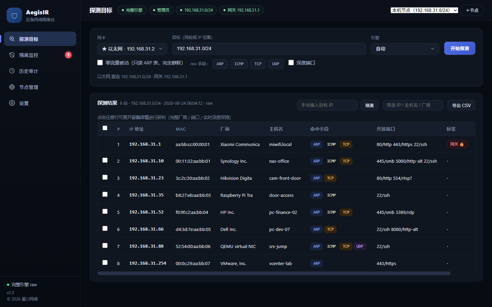
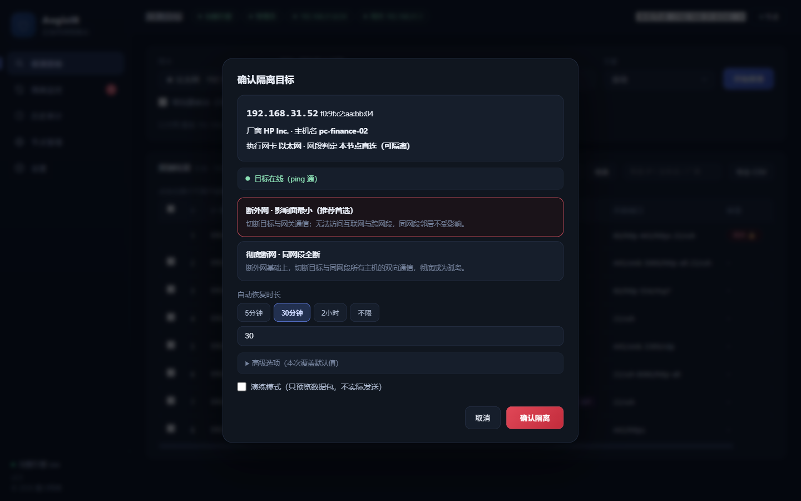
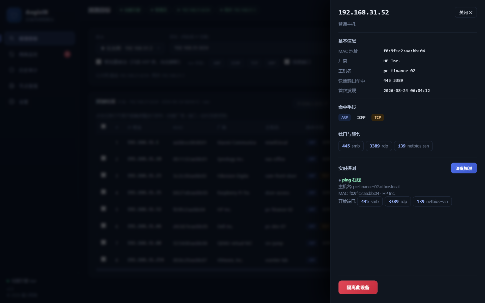
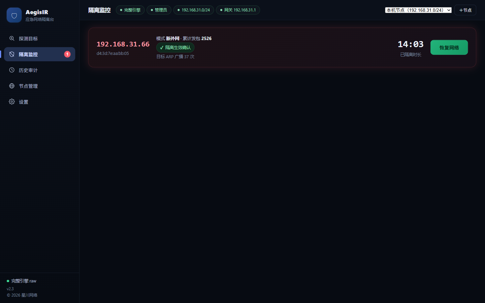
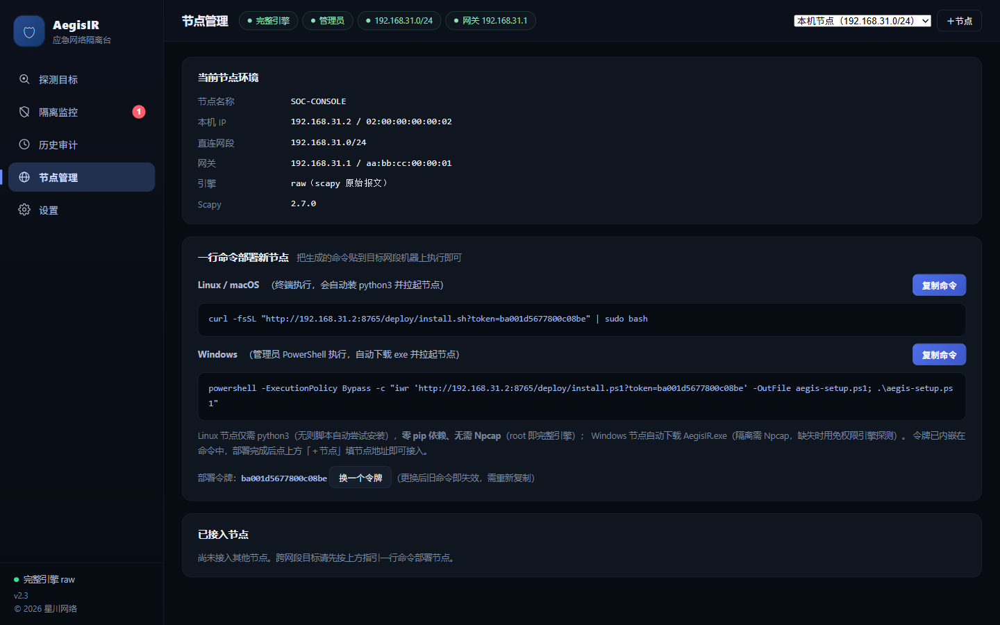
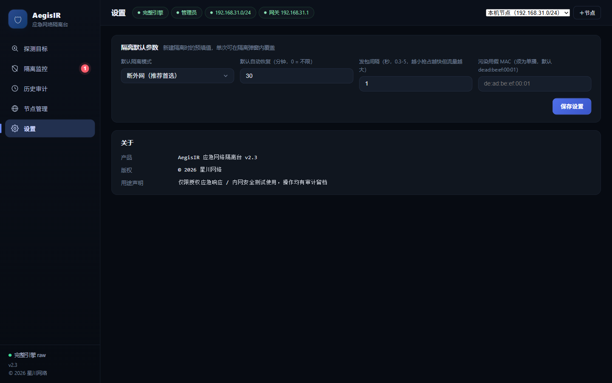
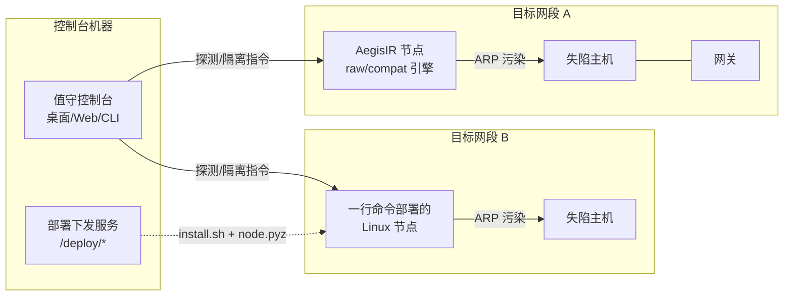
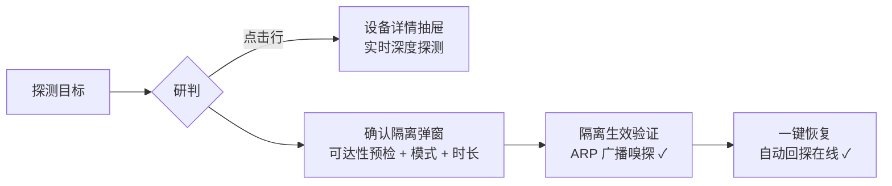

<div align="center">

# 🛡 AegisIR

**应急响应网络隔离台 · 第一时间在网络层止血**

内网设备被确认失陷（外联 / 横向移动 / 挖矿 / 挂马），一时无法物理接触或登录时，
用 AegisIR 在网络层把它隔离，为后续处置争取时间。


**桌面软件 · Web 控制台 · 命令行 三形态&nbsp;&nbsp;|&nbsp;&nbsp;Windows / Linux 双平台节点&nbsp;&nbsp;|&nbsp;&nbsp;零依赖跨网段部署**

</div>

> ⚠️ **本工具仅限授权应急响应 / 授权内网安全测试使用。** 对未授权网络实施 ARP 欺骗在多数司法辖区属违法行为。所有操作自动写入审计日志留档，可作为应急复盘与合规凭证。

---

## 📸 界面预览

| 探测与研判（点击行展开设备详情抽屉） | 隔离确认（可达性预检 + 模式选择 + 时长预设） |
|:---:|:---:|
|  |  |

| 设备详情 · 实时深度探测 | 隔离监控（生效确认 ✓ + 一键恢复） |
|:---:|:---:|
|  |  |

| 一行命令部署跨网段节点 | 操作员设置（参数完全开放） |
|:---:|:---:|
|  |  |

## ✨ 核心特性

**🔍 多引擎探测 —— 任何环境都能扫得出**
- **raw 引擎**（scapy 原始报文，管理员）：ARP sweep / ICMP / TCP SYN / UDP 四手段可勾选组合
- **compat 引擎**（免任何权限）：被动 ARP 表快照 + 64 线程系统 ping + ARP 表差分取 MAC + TCP connect——无管理员、受限终端照样工作
- **零流量被动模式**：只读系统 ARP 表，完全静默，应急侦查不打草惊蛇
- 支持 **CIDR 与 IP 范围**（`192.168.1.10-192.168.1.60`），大网段精确切片
- 富化：OUI 厂商 / 反向 DNS / nbtstat 主机名 / 常见端口识别 / CSV 导出留档
- 网卡手动选择，多网卡环境（WiFi / 有线 / VMware / WSL）自由指定出口

**⛔ 阻断与恢复 —— 不只是发包，还要证明生效**
- `offnet` 断外网（影响面最小，推荐首选）/ `island` 彻底断网（同网段全断）
- **隔离生效验证**：持续嗅探目标对网关的 ARP 广播请求，状态卡实时显示"✓ 隔离生效确认"——有证据的阻断
- **恢复三层保障**：一键/到时自动发真实 ARP 纠正（秒级）→ 进程被杀凭会话文件恢复 → 节点重启自动恢复遗留隔离 → 极端情况各主机缓存到期自愈
- 批量隔离 / 演练模式（只预览不发包）/ 保护名单 / 恢复后自动回探确认

**🖥 值守控制台 —— 零基础人员向**
- 桌面软件（双击 exe，UAC 自动提权）或浏览器访问，深空值守主题
- 向导式动线：探测 → 点行研判（设备详情抽屉 + 实时深度探测）→ 确认隔离 → 实时监控 → 一键恢复
- 操作员参数全开放：默认模式 / 恢复时长 / 发包间隔 / 污染 MAC，本地持久化 + 单次覆盖

**🌐 跨网段 —— 一行命令部署节点**
- Linux/macOS：`curl -fsSL "http://控制台:8765/deploy/install.sh?token=xxx" | sudo bash`
- Windows：管理员 PowerShell 一行脚本（自动下载 exe 并拉起）
- Linux 节点自包含 zipapp（2.5MB，aegis_ir + scapy），仅需 python3，**零 pip 依赖、无需 Npcap**（root 即完整引擎）
- 节点健康状态实时探测，控制台一键切换

## 🏗️ 架构





## 🚀 快速开始

### 方式一：桌面软件（推荐值守使用）

从 [Releases](../../releases) 下载 **AegisIR.exe**（约 80MB 单文件，UAC 自动提权），双击即用。目标机仅需 [Npcap](https://npcap.com)（隔离功能依赖；探测在无 Npcap 时自动降级免权限引擎）。

### 方式二：Python 运行

```bash
git clone https://github.com/chu0119/AegisIR.git
cd AegisIR
pip install -r requirements.txt

python run.py            # 桌面窗口模式（无参数默认）
python -m aegis_ir gui   # 浏览器版控制台 http://127.0.0.1:8765
```

### 方式三：命令行（脚本化处置）

```bash
python -m aegis_ir doctor                                # 环境自检
python -m aegis_ir scan --net 192.168.1.0/24 --ports     # 多引擎探测
python -m aegis_ir scan --net 192.168.1.10-60 --methods passive  # 零流量被动
python -m aegis_ir isolate 192.168.1.50                  # 断外网（推荐首选）
python -m aegis_ir isolate --pick --mode island --duration 600   # 彻底断网10分钟
python -m aegis_ir isolate 192.168.1.50 --dry-run        # 演练，不实际发包
python -m aegis_ir restore 192.168.1.50                  # 恢复
python -m aegis_ir token                                 # 生成节点部署令牌
```

## 📖 核心概念

**双探测引擎自动降级**

| | raw 引擎 | compat 引擎 |
|---|---|---|
| 权限要求 | 管理员 + Npcap | **无** |
| 手段 | ARP / ICMP / TCP SYN / UDP | 被动 ARP 快照 / 系统 ping / TCP connect |
| Linux | root 即可用（无需驱动） | ✅ |
| Windows | 需 Npcap | ✅（探测可用，隔离需管理员） |

**隔离模式**

| 模式 | 效果 | 适用 |
|---|---|---|
| `offnet` | 切断目标 ↔ 网关（断外网，同网段邻居不受影响） | 推荐首选，影响面最小 |
| `island` | 目标与网关及同网段全部主机双向全断 | 确认正在横向移动的目标 |

**为什么不提供某些"手段"**：远程 ARP 污染网关（企业路由器按接口隔离 ARP 表，不可靠）、DHCP 饿死（误伤全网段）、TCP RST 暴力注入（DoS 且不可靠）——均已论证并在设计上明确排除。

## 🧪 测试

```bash
python -m unittest discover -s tests -v   # 23 项，免权限可运行
```

## 🗺️ Roadmap

- [ ] SNMP 联动交换机端口关闭 / ACL 下发（设备侧通道）
- [ ] mDNS / LLMNR 服务名发现富化
- [ ] 多次扫描差异对比（新上线 / 掉线主机标记）
- [ ] 控制台多节点批量视图
- [ ] 英文界面 i18n

## ⚖️ 法律与授权

- 使用前须获得资产所有方 / 安全管理方的授权，隔离动作按应急流程报备
- 审计日志（`var/logs/audit.jsonl`）与隔离会话（`var/sessions/`）自动留档
- 目标配置静态 ARP、交换机开启 DAI / IP Source Guard 时污染失效（防护到位的表现，此时应走设备侧通道）

## 📄 License

Copyright © 2026 **星川网络 XingChuan Network**. 仅供授权使用，详见 [LICENSE](LICENSE).
